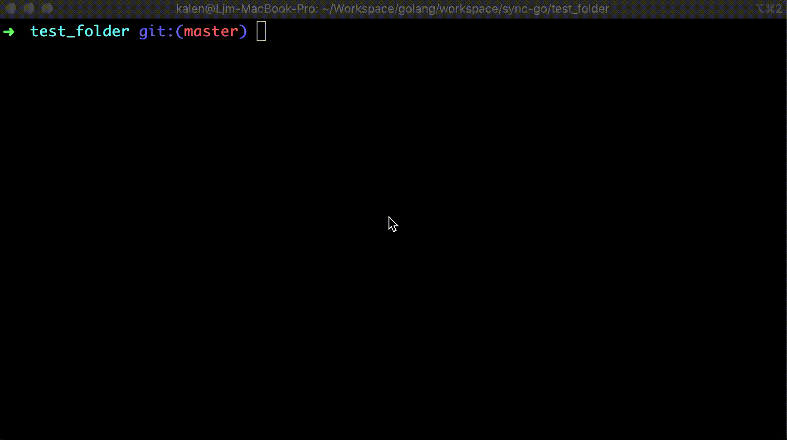
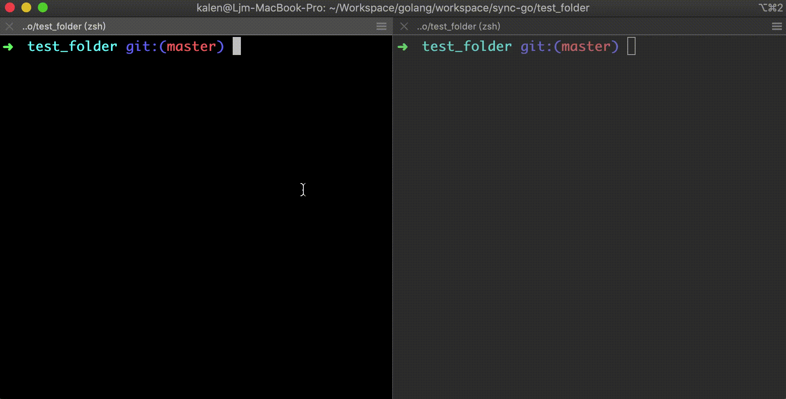

# sync-go
sync files between multiple remote servers using sftp.

## Why this Project
For common usage, the sftp syncronizer can be only used in local directory. If you use sftp-tool from a remote server to another remote server, the condition would be complicated. Between the remote server with network latency, I need to syncronize a file after I make sure the file is not being writed.

For example, when I use [https://github.com/serkanyersen/sync](https://github.com/serkanyersen/sync) in local folder, it works well. But my purpose is to sync my local dir to a remote dir, and then sync this remote dir to another remote dir. When doing this, I found most of files would be zero size afther syncronizing. And I am aware of the network latency problem. So I create this project.

## Usage
### Download linux-64 binary
download binary and then add to path.
``` bash
wget https://github.com/nladuo/sync-go/releases/download/1.0/sync-go
chmod +x sync-go
mv sync-go /usr/local/bin/
```

### Initialize the config file
use `sync-go init` to initialize the config file.


### Start syncronizing
And then use `sync-go` to syncronize your folders.


## Contribute to this Project
#### Install Dependencies
``` bash
make prepare
```

#### Build the Project
``` bash
make
```

## LICENSE
MIT
